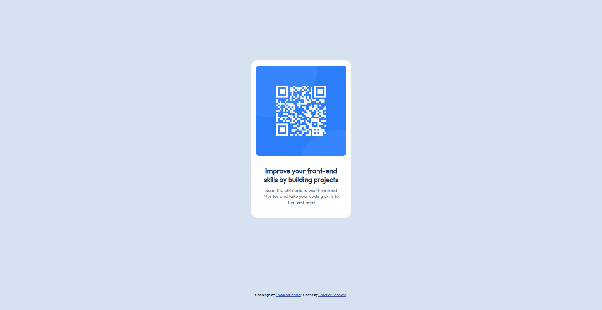

# Frontend Mentor - QR code component solution

This is a solution to the [QR code component challenge on Frontend Mentor](https://www.frontendmentor.io/challenges/qr-code-component-iux_sIO_H). Frontend Mentor challenges help you improve your coding skills by building realistic projects.

## Table of contents

- [Overview](#overview)
  - [Screenshot](#screenshot)
  - [Links](#links)
- [My process](#my-process)
  - [Built with](#built-with)
  - [What I learned](#what-i-learned)
  - [Continued development](#continued-development)
  - [Useful resources](#useful-resources)
- [Author](#author)

## Overview

### Screenshot



### Links

- Solution URL: [https://www.frontendmentor.io/solutions/responsive-qr-code-component-rlXUNDsXVF](https://www.frontendmentor.io/solutions/responsive-qr-code-component-rlXUNDsXVF)
- Live Site URL: [https://federick-pabalate.github.io/frontendmentor-qr-code/](https://federick-pabalate.github.io/frontendmentor-qr-code/)

## My process

### Built with

- HTML
- CSS
- Flexbox
- CSS Grid

### What I learned

I've been learning HTML and CSS through the challenge. Use assets from design to structure in HTML. In CSS, I discovered the grid for grid-based layout for the challenge using rows and columns. Separating main and attribution content in each of the rows. Flexbox makes it easier to structure items within a container.

What I learned is

To see how you can add code snippets, see below:

```css
.container {
  display: grid;
  grid-template-columns: 1fr;
  grid-template-rows: 1fr 10%; /* set 2 rows */
  grid-template-areas:
    "main"
    "attribution";
  grid-column-gap: 0px;
  grid-row-gap: 0px;
  height: 100vh;
  place-items: center; /* center content */
}

@media only screen and (max-width: 375px) {
  /* CSS rules to apply when the screen width is 375px or less */
  .card {
    width: 90%;
  }

  .card-img {
    width: 100%;
    height: auto;
  }
}
```

### Continued development

In my future project I'll give my time to myself to learn more about how responsive websites work by using Grid and Flexbox before learning CSS frameworks to further deepen my fundamentals in CSS.

### Useful resources

- [CSS Flexbox Layout Guide](https://css-tricks.com/snippets/css/a-guide-to-flexbox/) - This helped me for achieve column layout for the items in my qr code component card.
- [CSS Grid layout - MDN](https://developer.mozilla.org/en-US/docs/Web/CSS/CSS_grid_layout) - This is an amazing documentation which helped me finally understand how grid works. I'd recommend it to anyone still learning this concept.

## Author

- Frontend Mentor - [https://www.frontendmentor.io/profile/federick-pabalate](https://www.frontendmentor.io/profile/federick-pabalate)
- Github - [https://github.com/federick-pabalate](https://github.com/federick-pabalate)
